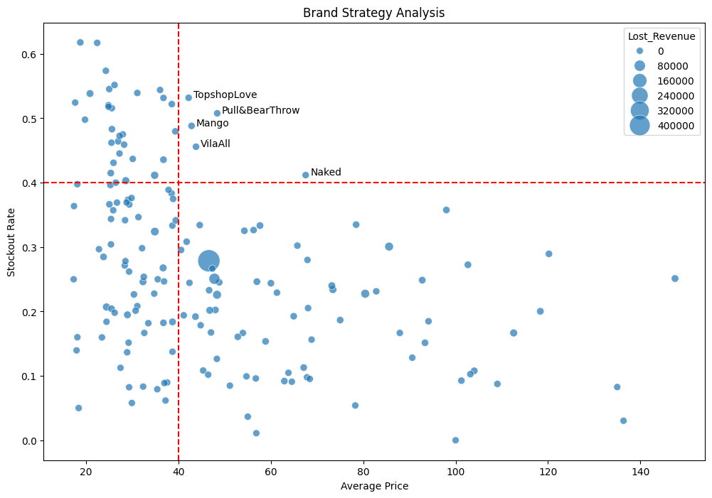

# ASOS Brand Strategy Analysis

Analyzing ASOS product data to identify which brands have the highest stockout rates relative to their price point — and estimating how much revenue is being lost as a result.

---

## 📊 The Chart



The scatter plot divides brands into 4 quadrants using two thresholds:
- **Price > £40** — mid to premium range
- **Stockout Rate > 40%** — significant availability problem

| Quadrant | Meaning | Action |
|---|---|---|
| 🔴 Top-Right | High price + high stockout — **"The Gold Mine"** | Restock immediately |
| 🟡 Top-Left | Low price + high stockout — essential items | Increase reorder frequency |
| 🔵 Bottom-Right | High price + low stockout — underperforming luxury | Consider liquidating |
| ⚪ Bottom-Left | Low price + low stockout — catalogue noise | Reduce SKU count |

---

## 🔍 Key Insight

Brands like **Mango**, **Pull&Bear**, and **Topshop** sit in the top-right quadrant — customers are willing to pay a premium *and* buying so fast that brands can't restock in time. These are the highest ROI targets for inventory investment.

---

## 🛠️ Tools Used

- **Python**
- **Pandas** — data cleaning & aggregation
- **Matplotlib** — chart rendering
- **Seaborn** — scatter plot styling

---

## 📁 Project Structure

```
├── analysis.ipynb                 # Full notebook with all steps
├── plan_and_insights.md           # Detailed plan & insights (6-step framework)
├── requirements.txt               # Python dependencies
├── brand_strategy_chart.png
└── README.md
```

---

## ▶️ How to Run

1. Clone the repo
```bash
git clone https://github.com/adham-eltantawi/asos-brand-strategy-analysis.git
cd asos-brand-strategy-analysis
```

2. Install dependencies
```bash
pip install -r requirements.txt
```

3. Add the dataset
```
Place products_asos.csv in the root folder
Dataset not included due to file size
```

4. Run the notebook
```bash
jupyter notebook analysis.ipynb
```

---

## 📌 Dataset
 
Scraped ASOS product listings — 30,845 rows × 9 columns including product name, price, size availability, color, SKU, and description.
 
📂 **[View Dataset on Google Sheets](https://www.kaggle.com/datasets/trainingdatapro/asos-e-commerce-dataset-30845-products)**
